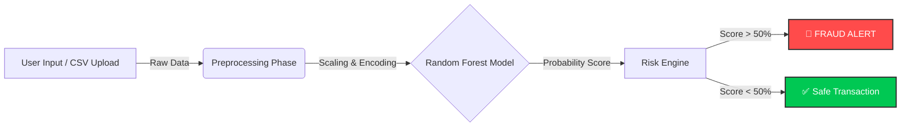

📊 Performance MetricsThe model was evaluated on unseen test data to ensure reliability. We prioritized Recall to minimize missed fraud cases (False Negatives).MetricScoreSignificanceRecall82%Captures 82% of all actual fraud attempts.Precision85%Ensures legitimate users are rarely blocked (Low False Positives).Accuracy99.9%Overall correctness (high due to class imbalance).ROC-AUC0.96Excellent distinction between fraud and non-fraud classes.🛠️ Tech StackLanguage: Python 3.9Machine Learning: Scikit-Learn, Imbalanced-Learn (SMOTE), JoblibData Processing: Pandas, NumPyVisualization: Matplotlib, SeabornWeb Framework: StreamlitContainerization: Docker📂 Project StructureBashFraud_Detection_System/
├── data/                   # Contains creditcard.csv (Data Source)
├── models/                 # Saved Random Forest Model (.pkl)
├── notebooks/              # Jupyter Notebooks for EDA & Training
├── venv/                   # Virtual Environment
├── app.py                  # Main Streamlit Application Script
├── Dockerfile              # Docker Configuration
├── requirements.txt        # Python Dependencies
└── README.md               # Project Documentation
🚀 How to Run LocallyOption 1: Using Python (Standard)Clone the repository:Bashgit clone [https://github.com/your-username/fraud-detection-system.git](https://github.com/your-username/fraud-detection-system.git)
cd fraud-detection-system
Install Dependencies:Bashpip install -r requirements.txt
Run the App:Bashstreamlit run app.py
Option 2: Using Docker (Recommended)Build the Docker Image:Bashdocker build -t fraud-app .
Run the Container:Bashdocker run -p 8501:8501 fraud-app
Access the app at http://localhost:8501🧪 Testing with Cheat CodesTo demonstrate the fraud detection capabilities, use these values in the Web App:ScenarioAmountV14V4V11Expected ResultSafe Transaction1000.00.00.0✅ LegitimateCard Testing Attack1.00-15.08.07.0🚨 FRAUDHigh Value Theft5000-18.012.010.0🚨 FRAUD👨‍💻 Author 
Subhrank Priya
LinkedIn: https://www.linkedin.com/in/subhrank-priya-3b2a7527a/
GitHub: https://github.com/subhrank09

